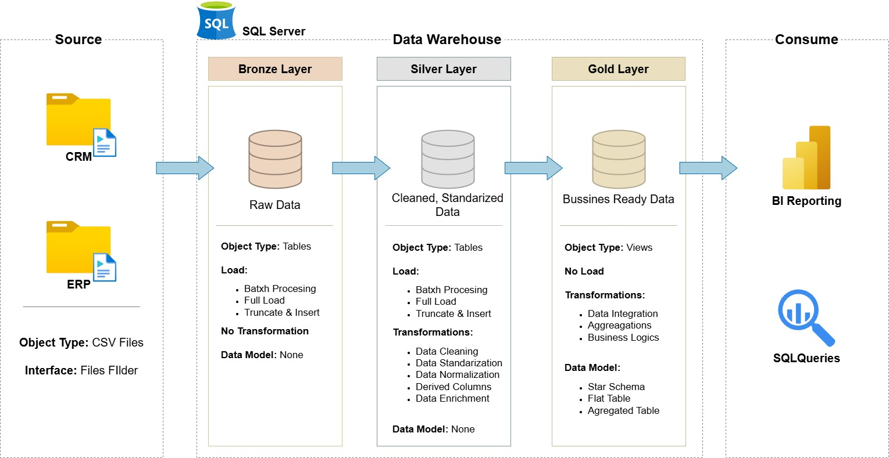
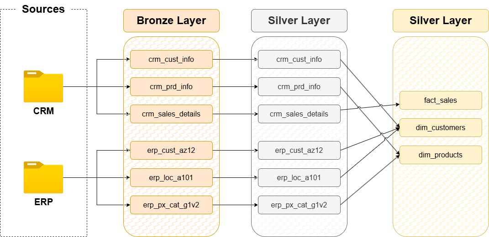

# 🏗️ Data Warehouse Project – Integración CRM & ERP

## 📌 Descripción

Este proyecto implementa un **Data Warehouse en SQL Server** siguiendo una arquitectura tipo **Medallion (Bronze, Silver, Gold)**, integrando datos provenientes de sistemas CRM y ERP para habilitar análisis de negocio y reporting.

El desarrollo se realizó como práctica guiada siguiendo los contenidos educativos del canal **Data with Baraa**:  
https://www.youtube.com/@DataWithBaraa

El objetivo fue aplicar buenas prácticas de Data Engineering, modelado dimensional y organización profesional de proyectos.

---

# 🏛️ Arquitectura

El flujo de datos sigue la siguiente estructura:

```
Sources → Bronze → Silver → Gold → BI / Analytics
```

## 📊 Arquitectura General



---

## 🥉 Bronze Layer – Raw Data

- Replica exacta de las fuentes
- Carga Batch (Full Load – Truncate & Insert)
- Sin transformaciones
- Tablas físicas

Objetivo:
Garantizar trazabilidad y mantener una copia fiel del sistema origen.

---

## 🥈 Silver Layer – Cleaned & Standardized Data

- Limpieza de datos
- Normalización
- Estandarización de formatos
- Columnas derivadas
- Enriquecimiento con datos ERP

Objetivo:
Preparar datos consistentes y confiables antes del modelado dimensional.

---

## 🥇 Gold Layer – Business Ready Data

- Integración de CRM y ERP
- Aplicación de reglas de negocio
- Construcción de modelo dimensional (Star Schema)
- Exposición mediante vistas analíticas

Objetivo:
Proveer datos optimizados para consultas analíticas y herramientas BI.

---

# 🔄 Linaje de Datos

El siguiente diagrama muestra el flujo desde las fuentes hasta el modelo final:



---

# 🧱 Modelo Dimensional (Gold Layer)

Se implementó un **Esquema Estrella** compuesto por:

## ⭐ Tabla de Hechos

### `gold.fact_sales`

Contiene métricas transaccionales:

- `sales_amount`
- `quantity`
- `price`

Llaves foráneas:
- `customer_key`
- `product_key`

---

## 📘 Dimensiones

### `gold.dim_customers`
Atributos descriptivos del cliente:
- Nombre
- Género
- Estado civil
- País
- Fecha de nacimiento
- Fecha de creación

### `gold.dim_products`
Atributos descriptivos del producto:
- Categoría
- Subcategoría
- Línea de producto
- Costo
- Fecha de inicio

---

# 📂 Estructura del Proyecto

```
DATA-WAREHOUSE-SQL/
│
├── datasets/            # Datasets crudos utilizados (CRM y ERP)
│
├── docs/                # Documentación e imágenes de arquitectura
│
├── scripts/
│   ├── bronze/          # Scripts de carga de datos crudos
│   ├── silver/          # Scripts de limpieza y transformación
│   ├── gold/            # Scripts de modelado dimensional
│
├── README.md
├── LICENSE
├── .gitignore
```

---

# 🛠️ Tecnologías Utilizadas

- SQL Server
- T-SQL
- Modelado Dimensional
- Arquitectura Medallion
- Procesos ETL Batch

---

# 📚 Aprendizajes Aplicados

- Diseño de Data Warehouse por capas
- Integración de múltiples fuentes
- Uso de claves sustitutas
- Separación entre datos crudos, limpios y analíticos
- Implementación de Star Schema
- Organización profesional de repositorio

---

# 🚀 Mejoras Futuras

- Implementar cargas incrementales
- Aplicar Slowly Changing Dimensions (SCD)
- Automatización con SQL Server Agent
- Validaciones de calidad de datos
- Estrategia de indexación para optimización

---

> Proyecto desarrollado como práctica guiada siguiendo los contenidos educativos del canal Data with Baraa.